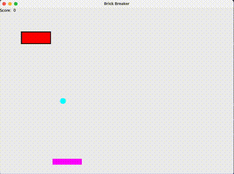

# Brick Breaker

## Overview
This project leverages artificial intelligence to train an AI agent to play the classic game BrickBreaker. The AI learns through training iterations and displays its best-performing version in a graphical user interface (GUI). The project is developed in Java and uses IntelliJ IDEA as the primary development environment.

## Instructions
The goal of BrickBreaker is to hit all the bricks on the screen using the ball. Here’s how it works:
- The ball begins on the paddle and is launched at a 45-degree angle.
- The ball bounces off the walls, the ceiling, and the paddle.
- The game ends if the ball falls below the level of the paddle.
- Clear all the bricks to win the game.

