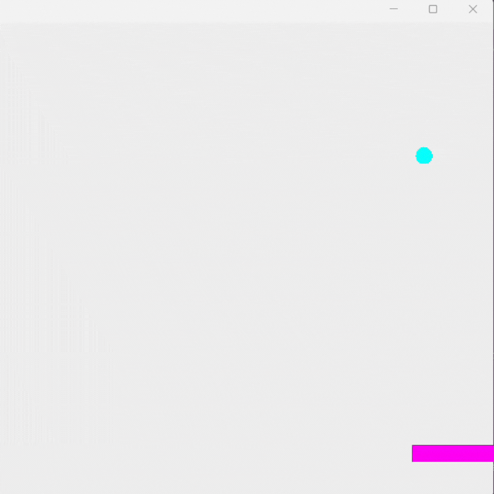

# BRICK BREAKER 

## INSTRUCTIONS
- The goal of Brick Breaker is to hit all the bricks on the screen using the ball
- The ball begins on the paddle and is launched at a 45-degree angle 
- The ball bounces off of the walls, the ceiling, and the paddle
- If the ball falls below the level of the paddle, the game is over

